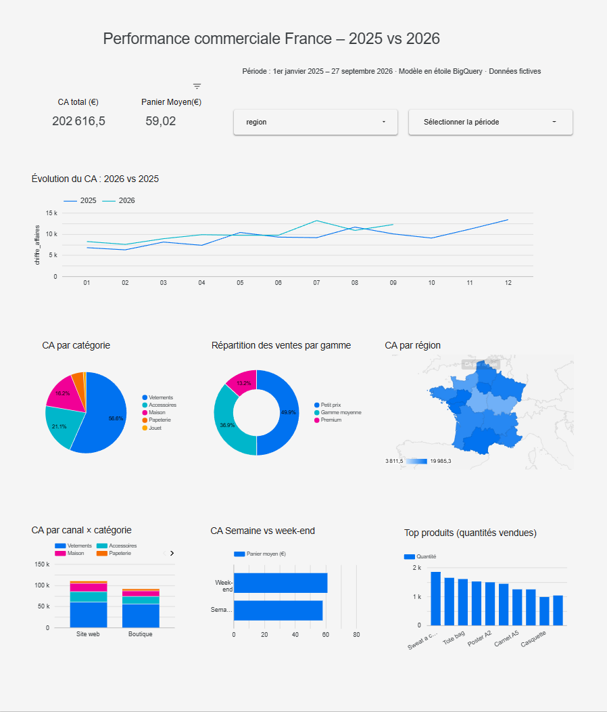
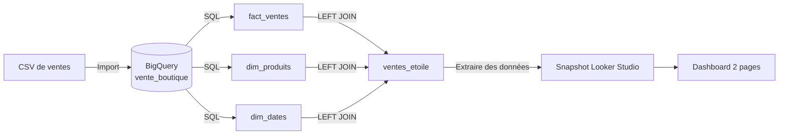
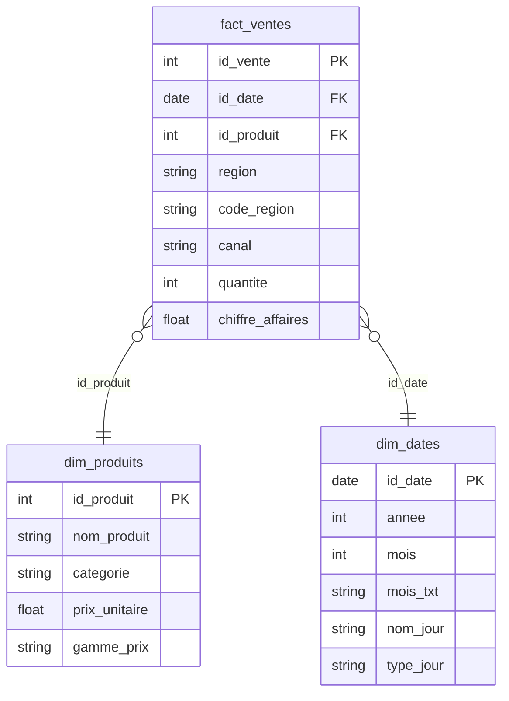
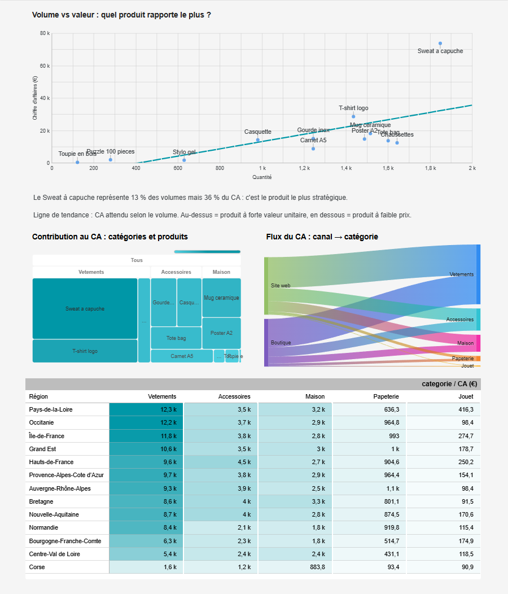

# Performance commerciale France – 2025 vs 2026

**Modélisation en étoile sur BigQuery et dashboard interactif Looker Studio**


👉 **[Voir le dashboard en ligne](https://datastudio.google.com/reporting/c97bb8a2-8a44-4593-99df-6cfaf919c3b3/page/QMv9F)**



---

## Contexte

Une boutique vend 12 produits (vêtements, accessoires, maison, papeterie, jouets) en boutique physique et sur son site web, dans les 13 régions de France métropolitaine.
Les ventes arrivent sous forme d'un **fichier plat** (une ligne par vente, avec le nom du produit, sa catégorie et son prix répétés à chaque ligne).

**Objectif :** transformer ce fichier en un **modèle analytique propre** et construire un dashboard qui répond à quatre questions :

1. Le chiffre d'affaires progresse-t-il par rapport à l'an dernier ?
2. Quelles régions et quels canaux performent le mieux ?
3. Quels produits rapportent le plus, en volume et en valeur ?
4. Les données affichées sont-elles fiables ?

---

## Chiffres clés

| Indicateur | Valeur |
|---|---|
| Période | janvier 2025 → septembre 2026 |
| Ventes | 3 433 |
| Chiffre d'affaires total | 202 616,50 € |
| Panier moyen | 59,02 € |
| CA janv.–sept. 2026 vs 2025 | **90 163 € vs 78 887 € (+14,3 %)** |

---

## Architecture



### Modèle en étoile



- **Table de faits** `fact_ventes` : une ligne = une vente, uniquement des clés et des mesures.
- **Dimension produits** : 12 lignes, avec une clé de substitution créée par `DENSE_RANK()` (le fichier source n'a pas d'identifiant produit) et une segmentation par gamme de prix.
- **Dimension calendrier** : générée avec `GENERATE_DATE_ARRAY` + `UNNEST`, elle contient **tous les jours**, y compris ceux sans vente, pour éviter les trous dans les analyses temporelles.

---

## Dashboard

**Page 1 – Vue d'ensemble :** KPI, évolution mensuelle 2026 vs 2025, carte par région, répartition par catégorie, canal et type de jour.

**Page 2 – Analyse produits :** volume vs valeur (nuage de points), contribution au CA (treemap), flux canal → catégorie (Sankey), heatmap région × catégorie.



Filtres interactifs : région, période, et filtrage croisé entre les graphiques.

---

## Principaux enseignements

- **Croissance de +14,3 %** sur janvier–septembre 2026 par rapport à 2025, avec un pic en juillet (+44 %). Seuls mai et août sont en recul.
- **Le Sweat à capuche** représente **13 % des volumes mais 36 % du CA** : c'est le produit le plus stratégique.
- Les produits à **petit prix** font la moitié des volumes (49,9 %) mais seulement un quart du CA (26,2 %).
- **Le site web devance la boutique dans toutes les catégories**, surtout en Maison (+51 %) et Accessoires (+38 %). Les vêtements se vendent presque autant en boutique qu'en ligne.
- **Le panier moyen est plus élevé le week-end** (61,25 €) que la semaine (58,11 €).

---

## Fiabilité des données : les problèmes rencontrés et corrigés

Chaque graphique a été vérifié par rapport aux totaux calculés en SQL. Cette démarche a permis de détecter quatre problèmes :

| Problème détecté | Symptôme | Correction |
|---|---|---|
| **Grain de la table de faits** non défini | Le panier moyen par région était faux d'environ 1 € (la fusion regroupait des ventes identiques), alors que le CA total était juste | Ajout d'une clé primaire `id_vente` (`ROW_NUMBER()`) |
| **Dimension produits non unique** | CA gonflé de 4 615 € : un même produit avait deux catégories, la jointure dupliquait ses ventes | Harmonisation des catégories + contrôle d'unicité systématique |
| **Libellés de régions sans accents** | Île-de-France et Auvergne-Rhône-Alpes absentes de la carte | Normalisation des libellés et ajout d'un **code ISO 3166-2** (`FR-IDF`…) pour la géolocalisation |
| **Agrégation de dates dans une fusion Looker Studio** | Courbe mensuelle avec des valeurs journalières | Champs de date calculés en amont, dans BigQuery |

**Principe retenu :** placer les calculs le plus en amont possible (dans BigQuery) et garder l'outil de visualisation pour l'affichage.

**À retenir :** dans une dimension, chaque produit doit avoir une seule catégorie et un seul prix ; sinon, la jointure compte ses ventes plusieurs fois.

---

## Structure du dépôt

```
├── README.md
├── data/
│   └── vente_boutique.csv        # 3 433 ventes fictives (2025-2026)
├── sql/
│   ├── 01_dim_produits.sql
│   ├── 02_dim_dates.sql
│   ├── 03_fact_ventes.sql
│   ├── 04_jointure_etoile.sql     # modèle en étoile joint, source du dashboard
│   └── 05_analyses_kpi.sql        # requêtes des KPI
└── images/                        # captures du dashboard
```

---

## Reproduire le projet

1. Créer un projet Google Cloud (le **BigQuery Sandbox** gratuit suffit).
2. Créer un dataset `boutique` et importer `data/vente_boutique.csv` dans une table `vente_boutique` (détection automatique du schéma).
3. Remplacer `my-project-septembre-2026` par l'identifiant de votre projet dans les fichiers SQL.
4. Lancer `sql/04_jointure_etoile.sql` : vous devez obtenir **3 433 lignes et 202 616,50 €**.
5. L'enregistrer comme vue `ventes_etoile` (instruction en tête du fichier), puis lancer `sql/05_analyses_kpi.sql`.
6. Dans Looker Studio : *Ajouter des données → BigQuery → Requête personnalisée*, coller `sql/04_jointure_etoile.sql`.

---

## Compétences mobilisées

`Modélisation dimensionnelle (schéma en étoile)` · `SQL BigQuery (CTE, fonctions de fenêtre, jointures)` · `Data visualisation` · `Contrôle qualité des données` · `Looker Studio (fusion, filtres, comparaison N-1, extraction)`

---

## À propos


Projet personnel réalisé pour apprendre **BigQuery** et **Looker Studio**, en complément de la formation **Concepteur Développeur en IA et Analyse Big Data**.
Les données sont **entièrement fictives** : le jeu de départ fourni en cours a été complété avec des données générées en Python (nouvelles régions, année 2025, catégorie Jouet).

**Xiaoqing ZHOU GRANDCOING** · [GitHub](https://github.com/XiaoqingGdc) · [LinkedIn](https://www.linkedin.com/in/xiaoqingzhougrandcoing)
